  &nbsp;&nbsp;
  &nbsp;&nbsp;
  &nbsp;&nbsp;
  

# JitterMap

Fleet-level retry admission with replayable evidence. JitterMap answers a system question that client-local backoff cannot: when many independently reasonable clients encounter one correlated failure, which retries should the fleet admit, defer, or deny?

## Capabilities

- deterministic discrete-event simulation with seeded full jitter;
- local, real AWS RetryConfig, adaptive drop/deferral, and deterministic tenant-fair strategies;
- aggregate and per-tenant RAF, success, denial, deferral, p95, and Jain fairness evidence;
- real RuVector outcome insert/search/read-back;
- real RVF witness-chain sealing;
- bounded MetaHarness Darwin/Flywheel evaluation with authority none.

## Quickstart

    cargo run --locked -- --scenario examples/correlated-outage.json --policy adaptive --memory .jitter-map-memory
    cargo run --locked -- --scenario examples/correlated-outage.json --policy adaptive-deferral --memory .jitter-map-memory
    cargo run --locked -- --scenario examples/skewed-tenant-outage.json --policy tenant-fair-budget --memory .jitter-map-memory
    cargo run --locked -- --scenario examples/skewed-tenant-outage.json --policy weighted-tenant-fair-budget --memory .jitter-map-memory
    cargo run --locked -p jitter-evaluation --bin jitter-benchmark
    cargo run --locked -p jitter-evaluation --bin jitter-fairness-benchmark

`--policy` accepts `local`, `aws`, `adaptive`, `adaptive-deferral`, `tenant-fair-budget`, or `weighted-tenant-fair-budget`. Equal-share fairness admits one event per non-empty tenant per round; demand-weighted fairness admits each tenant's validated scenario weight per round. Both rotate the starting tenant by tick and preserve shared-budget drop semantics; see [ADR-0021](docs/adrs/0021-tenant-fairness.md). The JSON receipt includes the exact scenario digest, typed aggregate/per-tenant report, nearest prior outcome IDs, witness root, and authority none.

MetaHarness evaluation uses the same compiled domain engine through `jitter-candidate`. Darwin supplies a numeric genome over stdin; Flywheel evaluates concrete policies, seals lineage, replays the frozen gate, and records zero autonomous promotions.

## Execution and data flow

## Workspace

| Crate | Responsibility |
|---|---|
| jitter-domain | typed scenario/policy model and deterministic engine |
| jitter-application | workflow and ports |
| jitter-adapter-aws | real AWS Smithy RetryConfig translation |
| jitter-adapter-ruvnet | RuVector memory and RVF sealing |
| jitter-evaluation | frozen baselines and ablations |
| jitter-map | usable CLI composition root |

## Upstream composition

| Ingredient | Executed contribution | Pin |
|---|---|---|
| AWS SDK for Rust | constructs/translates aws_smithy_types retry config | 193882fe11fce9b22424ac913eeb4d03963d5700 |
| RuVector | VectorDB insert/search/get outcome memory | source 5a93328f, crate 2.3.1 |
| RVF | witness creation and verification | rvf-crypto 0.2.0 |
| MetaHarness | bounded Darwin validation and Flywheel replay | source 9ce8b8d, packages 0.10.3/0.1.12 |

## Architecture and evidence

The [specification](docs/specification.md), [architecture](docs/architecture.md), [26 ADRs](docs/adrs/index.md), [12 DDD documents](docs/ddd/index.md), [frozen contract](docs/implementation-contract.md), [research](docs/research.md), and [traceability](docs/traceability.md) define the build. CI results and benchmark receipts are recorded under evidence.

## Frozen benchmark

The deterministic fixture contains 400 requests from eight tenants, a six-tick correlated throttling outage, capacity 25 per tick, seed 20261004, and a 200-tick horizon. All strategies consume the same scenario digest:
`bad5f95828899a03ce5858b97e1ddcffaecae89a79b824cbc0acf9cc469b3c9b`.

| Strategy | RAF | Successes | p95 | Attempts | Denied | Deferred | Jain fairness |
|---|---:|---:|---:|---:|---:|---:|---:|
| Local full jitter | 5.4375 | 364 | 24 | 2,175 | 0 | 0 | 0.9855 |
| AWS standard | 3.0000 | 0 | 0 | 1,200 | 0 | 0 | n/a |
| Adaptive shared budget | 5.3050 | 332 | 24 | 2,122 | 38 | 0 | 0.9365 |
| Adaptive deferral | 5.4425 | 329 | 24 | 2,177 | 0 | 55 | 0.9270 |
| Tenant-fair budget | 5.2875 | 336 | 23 | 2,115 | 38 | 0 | 0.9980 |
| Weighted tenant-fair budget | 5.2875 | 336 | 23 | 2,115 | 38 | 0 | 0.9980 |

The tenant-fair policy produced the best adaptive RAF, p95, successes, and fairness on the balanced fixture, but this remains a deterministic model rather than production proof. Deferral eliminated immediate denials but regressed RAF and successes versus drop. The AWS baseline exhausted its three attempts during the outage. Raw output is in [evidence/benchmark.json](evidence/benchmark.json).

### Skewed-tenant fairness ablation

A second frozen fixture assigns demand weights `[8,1,1,1,1,1,1,1]`. Equal-share tenant admission raised Jain fairness from **0.1250** to **0.8932**, with 63 successes. Demand-weighted admission raised fairness further to **0.9684** and recovered two successes (65), at the same 3.7100 RAF. It still trails the adaptive-drop baseline's 72 successes, so promotion remains blocked. Raw output is in [evidence/fairness-benchmark.json](evidence/fairness-benchmark.json).

## Maturity and limitations

This is a pre-1.0 evaluation system, not an SDK interceptor, deployment controller, or claim of production superiority. Neither tenant-fair candidate preserves the adaptive-drop success baseline on the skewed fixture. The discrete-event model does not reproduce every network, SDK, or scheduler behavior. RuVector local file storage is evaluation-only; production persistence must remain behind authorized RuVector/Cloud SQL infrastructure. MetaHarness can propose and score policy candidates but cannot promote them. No component may self-promote a policy.
