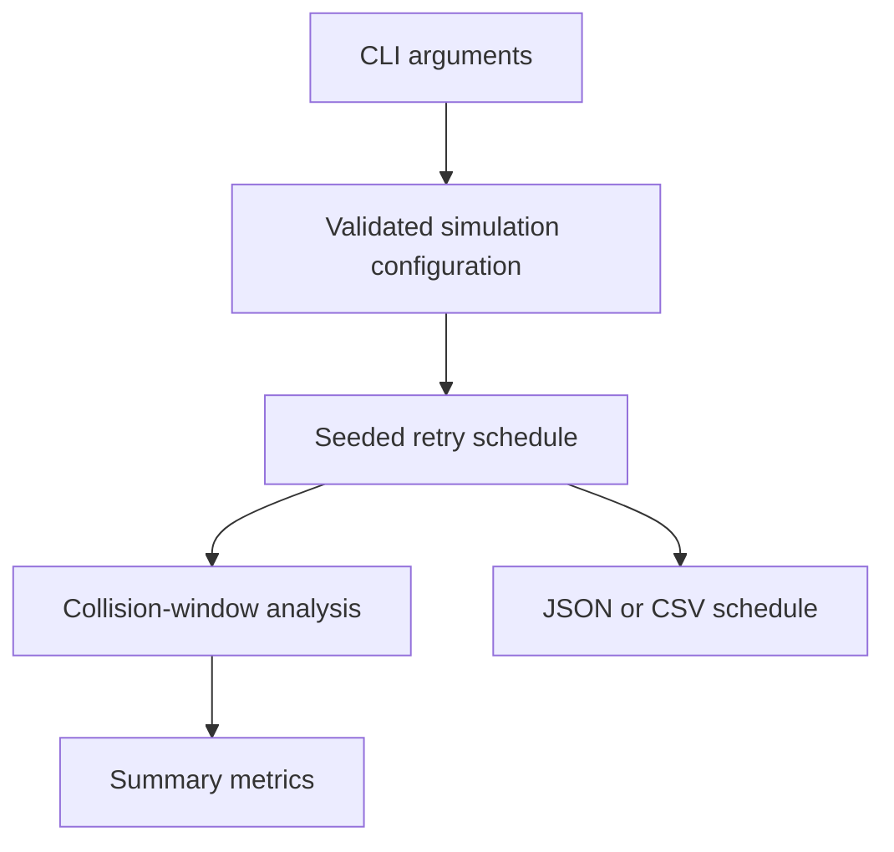

[](https://www.rust-lang.org/)

# jitter-map

`jitter-map` is a deterministic retry-schedule simulator for engineers tuning
backoff before a fleet rollout. It shows when every client will wake up and
counts the collision windows where retries can become a new traffic spike.

It supports full jitter, equal jitter, decorrelated jitter, and an unjittered
baseline. A seed makes every generated plan reproducible for reviews and CI.

## Project status

This release is a standalone retry simulation utility. It has one crate and
does not yet integrate Ruvnet or enterprise open-source systems. It does not
meet the Dream Machine project completion standard: architecture decision
records, detailed domain design, integrated upstream components, benchmark
evidence, and verified research/build Gist publication remain outstanding.

## Execution flow



The diagram describes the current in-memory simulator. There is no network
executor, persistent memory, or external integration in this release.

## Install

```console
cargo install --git https://github.com/nicholas-ruest/jitter-map
```

Or build from a checkout with stable Rust 1.85 or newer:

```console
cargo build --release
```

## Use

Compare a 100-client fleet using full jitter:

```console
jitter-map \
  --clients 100 \
  --attempts 6 \
  --base 100ms \
  --cap 30s \
  --strategy full \
  --seed 42 \
  --collision-window 10ms \
  --summary-only
```

Example output:

```text
total events: 600
occupied windows: 241
colliding client-windows: 481
collision pairs: 1311
peak window load: 23
```

Get the complete schedule as JSON or CSV:

```console
jitter-map --clients 25 --strategy equal --format json > plan.json
jitter-map --clients 25 --strategy decorrelated --format csv > plan.csv
```

Accepted durations are integers with `ms`, `s`, `m`, or `h` suffixes. A bare
integer is treated as milliseconds. Run `jitter-map --help` for every option.

## What the metrics mean

- **occupied windows**: time buckets containing at least one retry.
- **colliding client-windows**: client appearances in buckets shared with at
  least one other client. One client is counted at most once per bucket.
- **collision pairs**: pairs of distinct clients sharing a bucket.
- **peak window load**: the largest number of distinct clients in one bucket.

The model deliberately stays small: all clients start at time zero, schedules
are generated in memory, and network latency or server-directed retry hints are
not simulated. The CLI rejects plans above 5,000,000 events.

## Reproducibility

The pseudorandom mapping is implemented in this crate and keyed by seed,
client, and attempt. The same release, arguments, and seed produce byte-for-byte
identical JSON output across runs.

## Verify

```console
cargo fmt --check
cargo clippy --all-targets --all-features -- -D warnings
cargo test --all-features
```

## License

MIT
