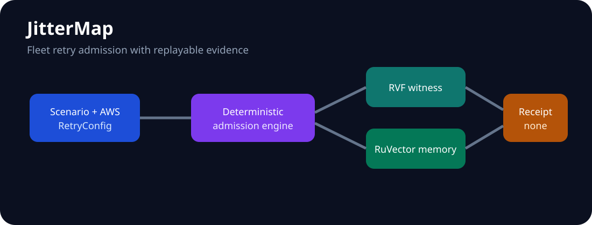

  &nbsp;&nbsp;
  &nbsp;&nbsp;
  &nbsp;&nbsp;
  

# JitterMap

Fleet-level retry admission with replayable evidence. JitterMap answers a system question that client-local backoff cannot: when many independently reasonable clients encounter one correlated failure, which retries should the fleet admit?

## Capabilities

- deterministic discrete-event simulation with seeded full jitter;
- local, real AWS RetryConfig, and adaptive shared-budget strategies;
- Retry Amplification Factor, success, denial, and p95 evidence;
- real RuVector outcome insert/search/read-back;
- real RVF witness-chain sealing;
- bounded MetaHarness Darwin/Flywheel evaluation with authority none.

## Quickstart

    cargo run --locked -- --scenario examples/correlated-outage.json --policy adaptive --memory .jitter-map-memory
    cargo run --locked -p jitter-evaluation --bin jitter-benchmark

The JSON receipt includes the exact scenario digest, report, nearest prior outcome IDs, witness root, and authority none. It is evidence, not a production change.

MetaHarness evaluation uses the same compiled domain engine through `jitter-candidate`. Darwin supplies a numeric genome over stdin; Flywheel evaluates concrete policies, seals lineage, replays the frozen gate, and records zero autonomous promotions.

## Workspace

| Crate | Responsibility |
|---|---|
| jitter-domain | typed scenario/policy model and deterministic engine |
| jitter-application | workflow and ports |
| jitter-adapter-aws | real AWS Smithy RetryConfig translation |
| jitter-adapter-ruvnet | RuVector memory and RVF sealing |
| jitter-evaluation | frozen baselines and ablations |
| jitter-map | usable CLI composition root |

## Upstream composition

| Ingredient | Executed contribution | Pin |
|---|---|---|
| AWS SDK for Rust | constructs/translates aws_smithy_types retry config | 193882fe11fce9b22424ac913eeb4d03963d5700 |
| RuVector | VectorDB insert/search/get outcome memory | source 5a93328f, crate 2.3.1 |
| RVF | witness creation and verification | rvf-crypto 0.2.0 |
| MetaHarness | bounded Darwin validation and Flywheel replay | source 9ce8b8d, packages 0.10.3/0.1.12 |

## Architecture and evidence

The [specification](docs/specification.md), [architecture](docs/architecture.md), [25 ADRs](docs/adrs/index.md), [12 DDD documents](docs/ddd/index.md), [frozen contract](docs/implementation-contract.md), [research](docs/research.md), and [traceability](docs/traceability.md) define the build. CI results and benchmark receipts are recorded under evidence.

## Frozen benchmark

The deterministic fixture contains 400 requests from eight tenants, a six-tick correlated throttling outage, capacity 25 per tick, seed 20261004, and a 200-tick horizon. All strategies consume the same scenario digest:
`da09384a2793c13f191197de6f4bb4ea15f60e67765c19fd338f4a590f53889d`.

| Strategy | Retry amplification | Successes | p95 ticks | Attempts | Denied retries |
|---|---:|---:|---:|---:|---:|
| Local full jitter | 5.4375 | 364 | 24 | 2,175 | 0 |
| AWS standard | 3.0000 | 0 | 0 | 1,200 | 0 |
| Adaptive shared budget | 5.3050 | 332 | 24 | 2,122 | 38 |

The adaptive candidate reduced amplification by only 2.4% while losing 8.8% of successful outcomes versus local jitter. The AWS-standard baseline exhausted its three attempts during the frozen outage. Neither result clears a production-promotion gate; the current decision is **REVISE**. Raw output is in [evidence/benchmark.json](evidence/benchmark.json).

## Maturity and limitations

This is a pre-1.0 evaluation system, not an SDK interceptor, deployment controller, or claim of production superiority. The current frozen candidate does not beat the success-preservation gate. The discrete-event model does not reproduce every network, SDK, or scheduler behavior. RuVector local file storage is evaluation-only; production persistence must remain behind authorized RuVector/Cloud SQL infrastructure. MetaHarness can propose and score policy candidates but cannot promote them. No component may self-promote a policy.
