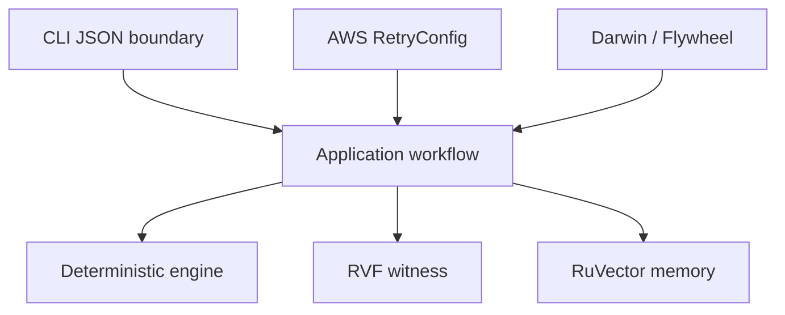

# Architecture

The domain crate has no adapter dependencies. Application depends inward and declares ports. AWS and Ruvnet adapters implement ports. Evaluation composes candidates; the root CLI is the composition root. The executable is stateless. Production GCP remains IAM scoped and reaches Cloud SQL only through authorized RuVector infrastructure.

## Demand-weighted admission path

The domain engine alone owns same-tick queue ordering. `WeightedTenantFairBudget` reads already-validated scenario weights, creates per-tenant FIFO queues, rotates the first queue by tick, and consumes each weight as the round quantum. The AWS adapter supplies the same bounded retry budget as other adaptive policies; application, RuVector, RVF, CLI and evaluation boundaries remain unchanged.
