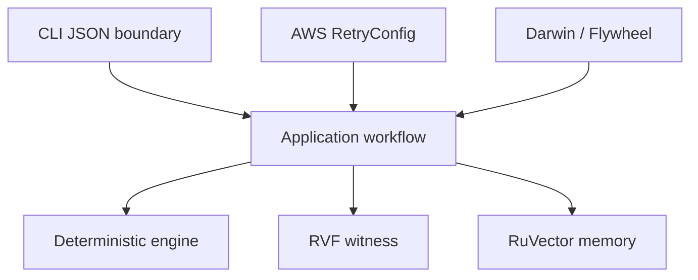

# Architecture

The domain crate has no adapter dependencies. Application depends inward and declares ports. AWS and Ruvnet adapters implement ports. Evaluation composes candidates; the root CLI is the composition root. The executable is stateless. Production GCP remains IAM scoped and reaches Cloud SQL only through authorized RuVector infrastructure.
